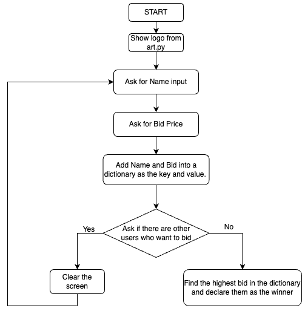

# SECRET BID AUCTION

# Instructions

Implement a [First-price sealed-bid auction](https://en.wikipedia.org/wiki/First-price_sealed-bid_auction) program, where a series of bidders will place their bid for an item. Then, the user with the highest bid will win the auctioned object.

All bidders won't be able to see the other bidders bids, it needs to be a secret

The following flowchart shows the way the program should be behaving:

